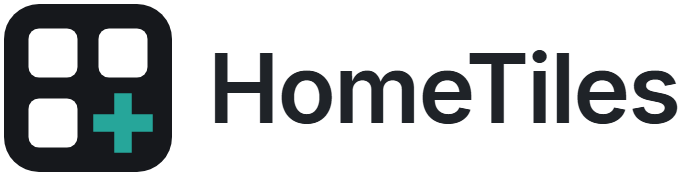
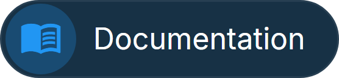
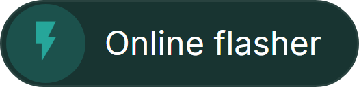
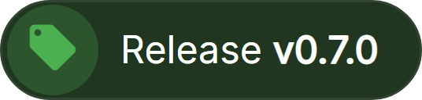
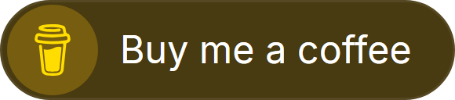
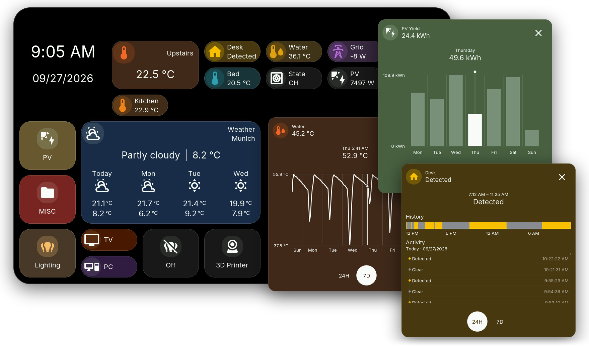
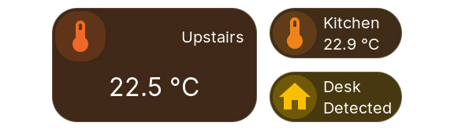
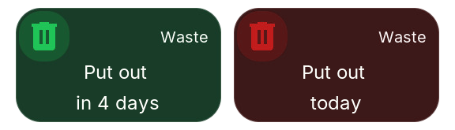
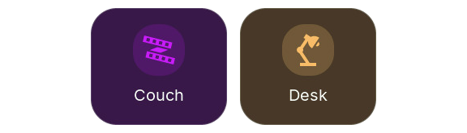
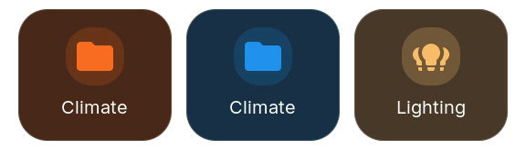

<picture>
  <source media="(prefers-color-scheme: dark)" srcset="docs/images/readme-logo-dark.png">
  
</picture>

Touch dashboards for Home Assistant on ESP32 displays. 
Lights, climate, sensors, energy, weather and more on a 4 to 10.1 inch touch screen.

 
 
Tap a tile for its popup, then slide through the history of sensors, energy and binary sensors.

## New in v0.7.0

 
<picture>
  <source media="(prefers-color-scheme: dark)" srcset="docs/images/readme-caption-row1-dark.svg">
  
</picture>

 
<picture>
  <source media="(prefers-color-scheme: dark)" srcset="docs/images/readme-caption-row2-dark.svg">
  
</picture>

- **Half-size tiles:** place and size tiles in half steps.
- **Color rules:** tiles change color by value or state.
- **Light colors:** light tiles show the color of the light.
- **Folders follow an entity:** a climate folder turns orange while heating.
- **Graph readout:** slide through sensor and energy history.
- **Built-in cameras:** ESP32-P4 displays stream to Home Assistant.

Before updating, update HomeTiles Bridge to **v0.7.0** and [export your dashboard](https://galusperes.github.io/updating/). [All changes](docs/releases/v0.7.0.md)

## Get started

You need a compatible display, Home Assistant, an MQTT broker and [HomeTiles Bridge](https://github.com/GalusPeres/HomeTiles-Bridge).

1. Find your exact model in the [device list](https://galusperes.github.io/#device-support).
2. Install it with the [online flasher](https://galusperes.github.io/installer/).
3. Connect [Home Assistant](https://galusperes.github.io/home-assistant-setup/) and [build your dashboard](https://galusperes.github.io/web-admin/) in the browser.

Camera tiles are experimental and available on ESP32-P4 only.

## Help

[Firmware updates](https://galusperes.github.io/updating/) · [Troubleshooting](https://galusperes.github.io/faq/) · [Report a problem](https://github.com/GalusPeres/HomeTiles/issues) · [Contribute](CONTRIBUTING.md) · [Architecture](ARCHITECTURE.md)

HomeTiles is free and open source under the [MIT License](LICENSE).
