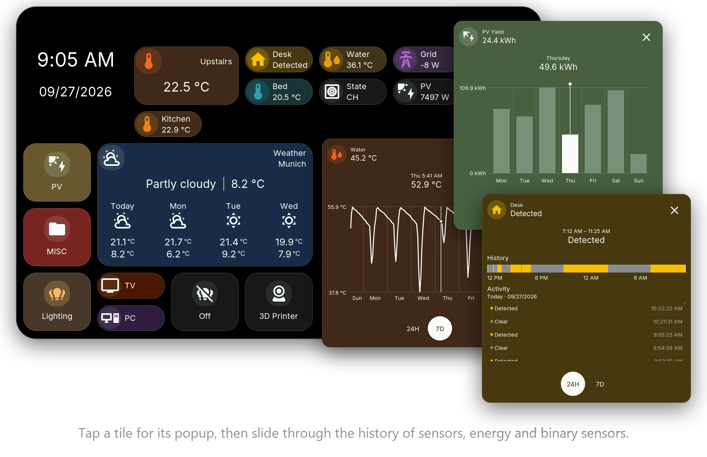
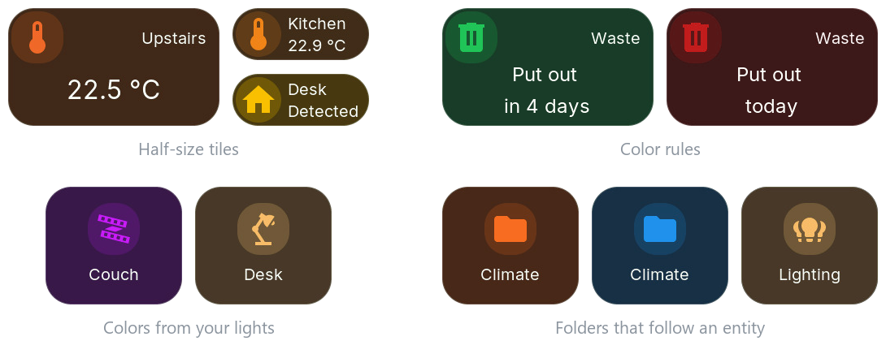

<picture>
  <source media="(prefers-color-scheme: dark)" srcset="docs/images/readme-title-dark.png">
  
</picture>

**Touch dashboards for Home Assistant on ESP32 displays.** Lights, climate, sensors, energy, weather and more on a 4 to 10.1 inch touch screen.

## New in v0.7.0

Half-size tiles, icon circles, color rules and adjustable corners. Folders can follow an entity, like a climate folder that turns orange while heating and blue while cooling, or a lighting folder in the color of its lights. Built-in cameras are shared with Home Assistant. Update HomeTiles Bridge to **v0.7.0** first and [export your dashboard](https://galusperes.github.io/updating/) before updating. [All changes](docs/releases/v0.7.0.md)

## Get started

You need a compatible display, Home Assistant, an MQTT broker and [HomeTiles Bridge](https://github.com/GalusPeres/HomeTiles-Bridge).

1. Find your exact model in the [device list](https://galusperes.github.io/#device-support).
2. Install it with the [online flasher](https://galusperes.github.io/installer/).
3. Connect [Home Assistant](https://galusperes.github.io/home-assistant-setup/) and [build your dashboard](https://galusperes.github.io/web-admin/) in the browser.

Camera tiles are experimental and available on ESP32-P4 only.

## Help

[Firmware updates](https://galusperes.github.io/updating/) · [Troubleshooting](https://galusperes.github.io/faq/) · [Report a problem](https://github.com/GalusPeres/HomeTiles/issues) · [Contribute](CONTRIBUTING.md) · [Architecture](ARCHITECTURE.md)

HomeTiles is free and open source under the [MIT License](LICENSE).
