# On-Device UI

Tap tiles to control devices, open folders, or view details. Configure the layout in the [Web Admin](web-admin.md).

<figure class="ht-screenshot">
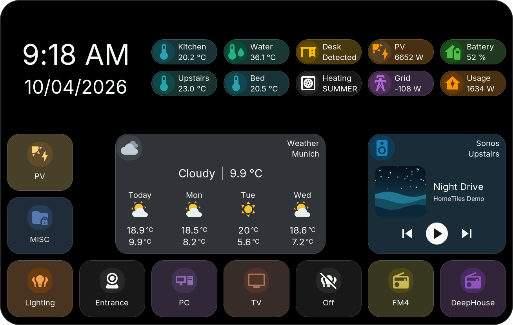
<figcaption>HomeTiles dashboard</figcaption>
</figure>

Every icon sits on a round circle, and a tile can take on its icon's color. Tiles and circles use the same corner radius, and half-height tiles show their title and value next to the icon. Colors, circles, and radius are set in the [Web Admin](web-admin.md#global-settings); [rules](web-admin.md#colors-and-rules) can color a tile by the state of an entity.

Folders have their own grid. The back tile returns to the previous page.

<figure class="ht-screenshot">
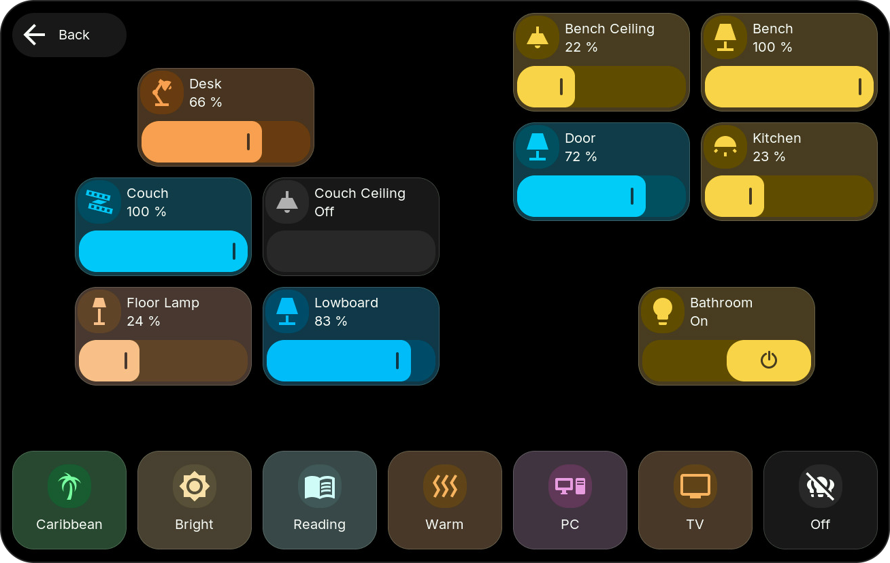
<figcaption>Folder with light tiles and scenes</figcaption>
</figure>

A protected folder asks for its PIN first. The PIN pad takes the folder tile's color.

<figure class="ht-screenshot ht-popup">
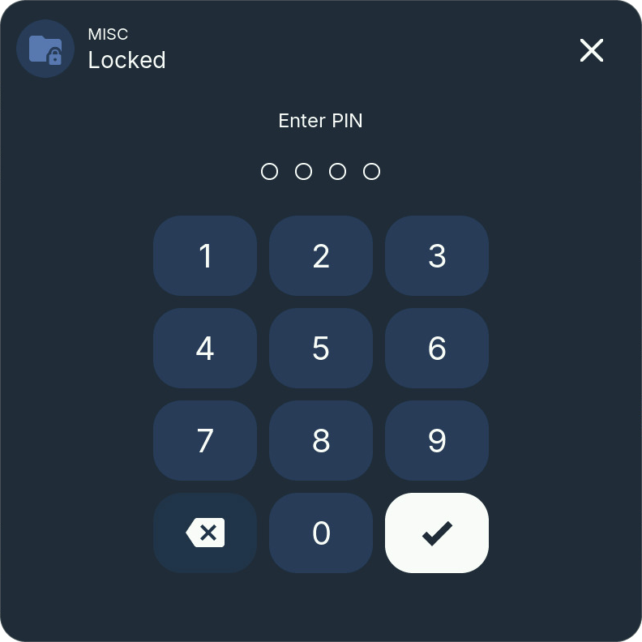
<figcaption>PIN entry for a protected folder</figcaption>
</figure>

## Popups

For tiles with detail controls, choose a tap or long press as the popup trigger in the Web Admin. Popups take on the look of their tile: the header shows the tile's icon and circle, and most popups use the tile's color.

Home Assistant can also open a folder or popup using the display's [View Select entity](bridge.md#control-the-displayed-view).

### Light Control

Switch tiles assigned to a `light` entity open brightness, color, and color-temperature controls. The bottom icons switch views; the power button toggles the light. Only supported controls appear.

<figure class="ht-screenshot">
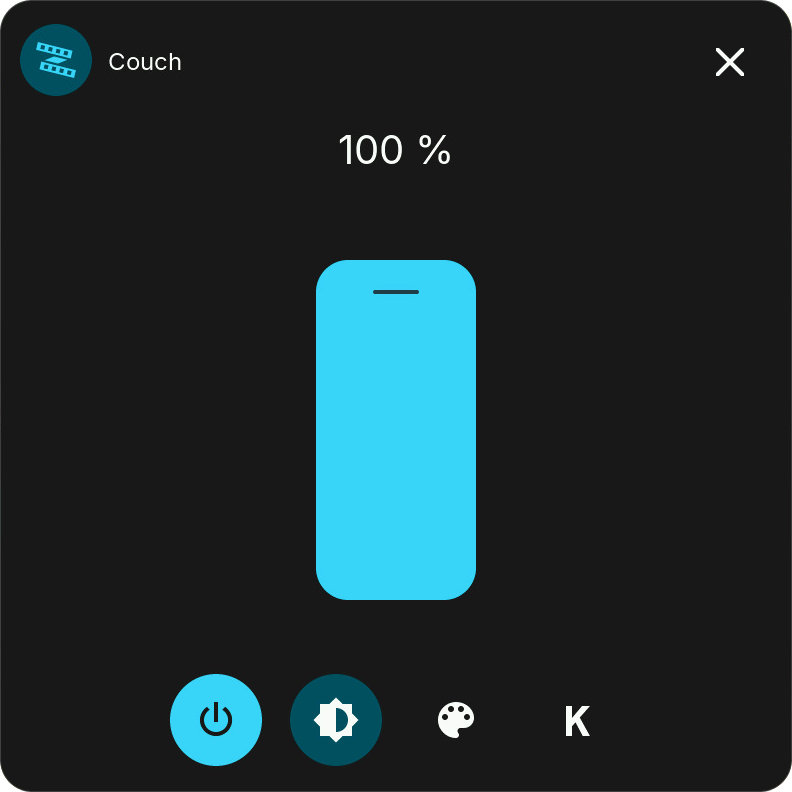
<figcaption>Brightness</figcaption>
</figure>
<figure class="ht-screenshot">
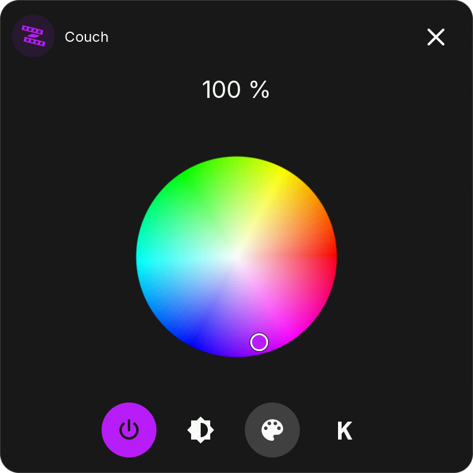
<figcaption>Color</figcaption>
</figure>
<figure class="ht-screenshot">
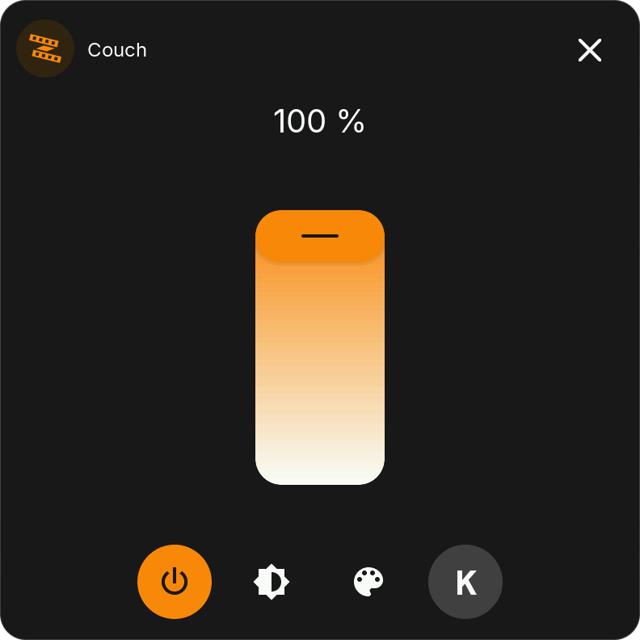
<figcaption>Color temperature</figcaption>
</figure>

### Cover Control

Use separate position and tilt sliders, or switch to open, close, and stop buttons. Controls depend on the cover's capabilities and availability.

<figure class="ht-screenshot ht-popup">
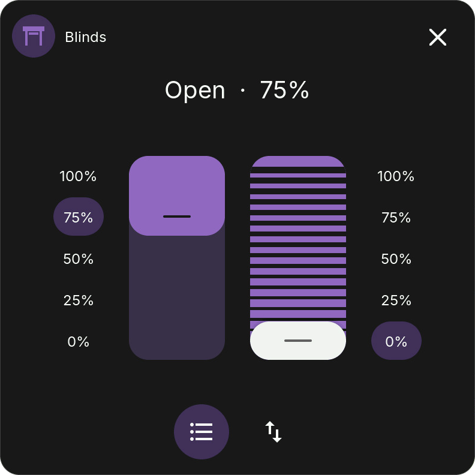
<figcaption>Cover position and tilt</figcaption>
</figure>

### Sensor And Binary Sensor History { data-toc-label="Sensor history" }

Choose a **24-hour** or **7-day** view. Numeric sensors show a graph; binary and text-valued sensors show a state timeline and scrollable Activity list. The header shows the current value.

To read an earlier value, touch the graph and move your finger along it. The time and value appear above the graph, and the marker stays where you let go.

<figure class="ht-screenshot">
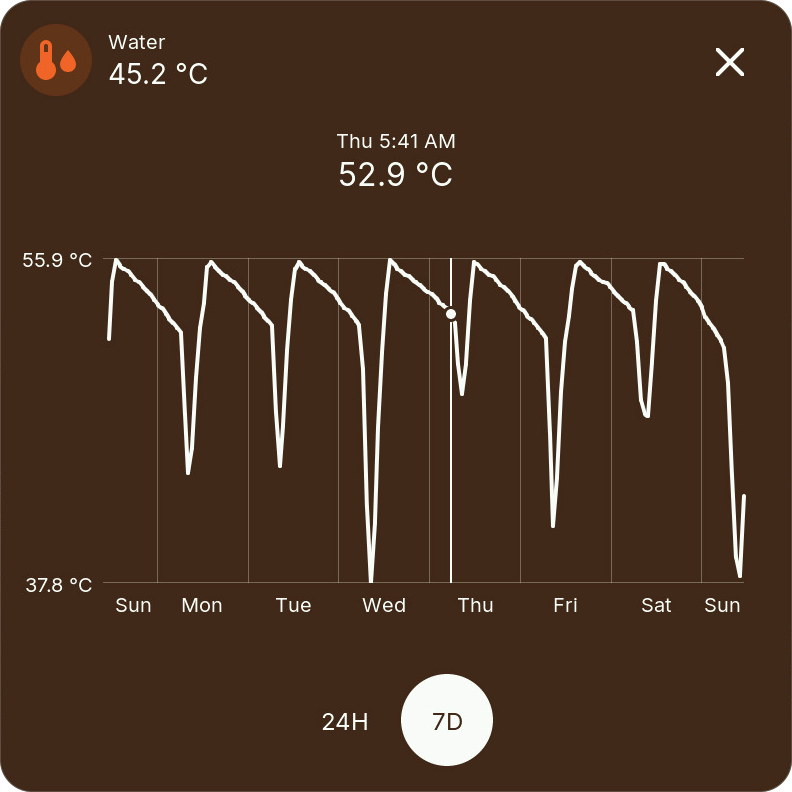
<figcaption>Sensor graph with a read value</figcaption>
</figure>
<figure class="ht-screenshot">
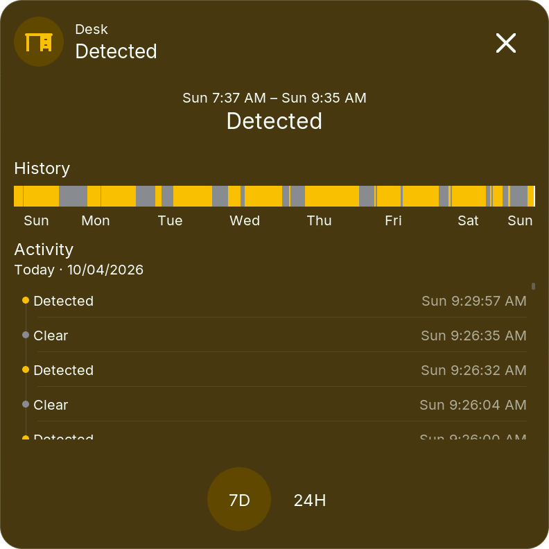
<figcaption>Binary sensor timeline</figcaption>
</figure>

### Number, Select, and Date/Time

Editable controls sit above their history. Number uses a slider, a Climate-style temperature stepper, or a roller; Select uses the Settings dropdown; Date/Time uses swipeable time values and date step controls. See the [editable tile reference](tiles.md#number) for supported entities and input modes.

Number shows a graph and Activity; Select uses a compact timeline and gives the remaining space to Activity. Date/Time shows Activity below its taller controls. **24H / 7D** changes the requested period while keeping the previous data visible until the reply arrives.

<figure class="ht-screenshot">
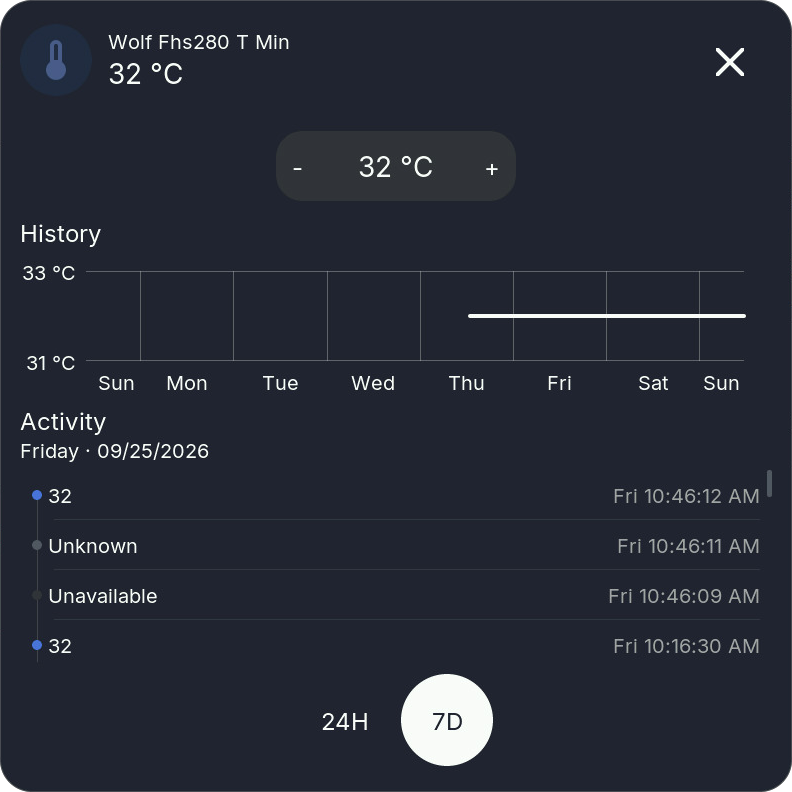
<figcaption>Number</figcaption>
</figure>
<figure class="ht-screenshot">
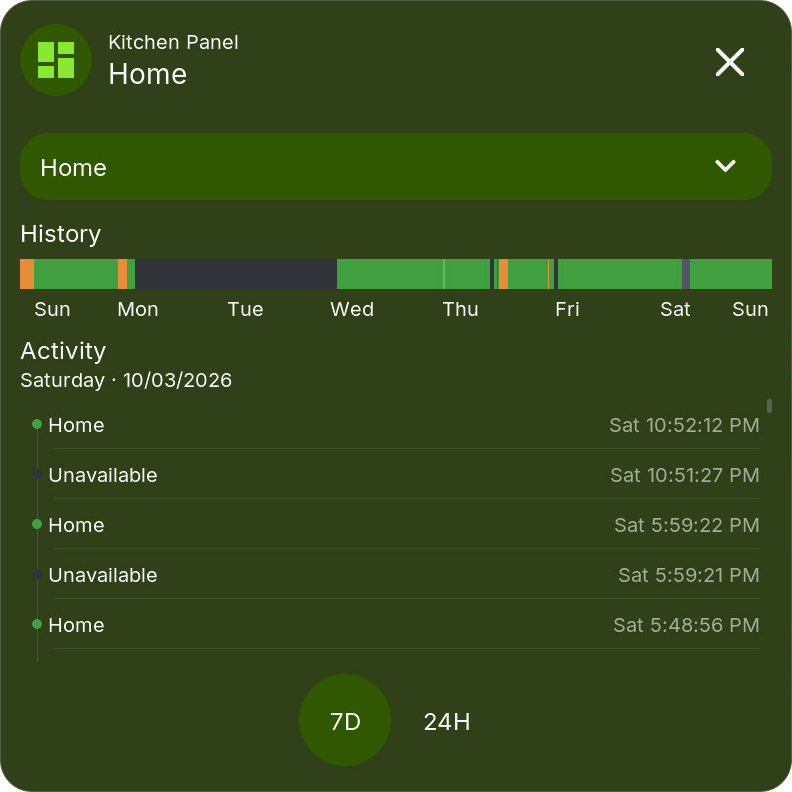
<figcaption>Select</figcaption>
</figure>
<figure class="ht-screenshot">
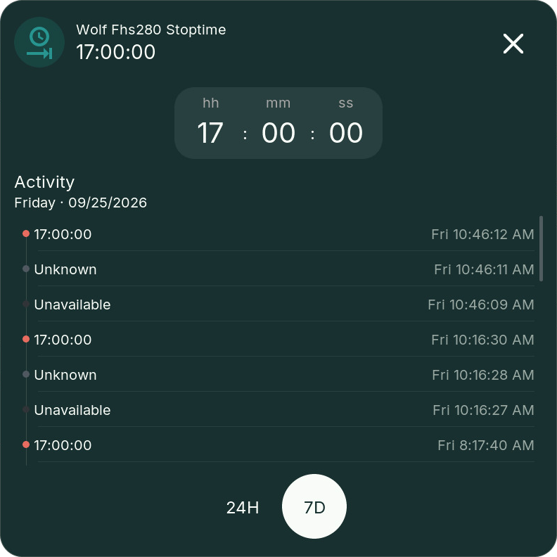
<figcaption>Date/Time</figcaption>
</figure>

Slider edits are sent on release. Step and time edits are grouped after a short pause. A slow HA device can take time to confirm the new value; the display keeps your edit while it waits. Control backgrounds follow the tile color.

### Energy Statistics

Energy popups show hourly bars for the day and daily bars for the week. Tap a bar to read its time and value; a dot marks the bar you read.

<figure class="ht-screenshot">
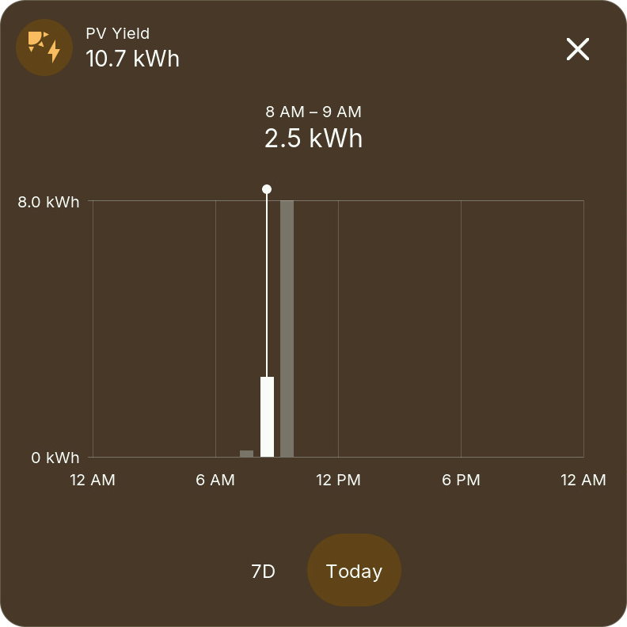
<figcaption>24 hours</figcaption>
</figure>
<figure class="ht-screenshot">
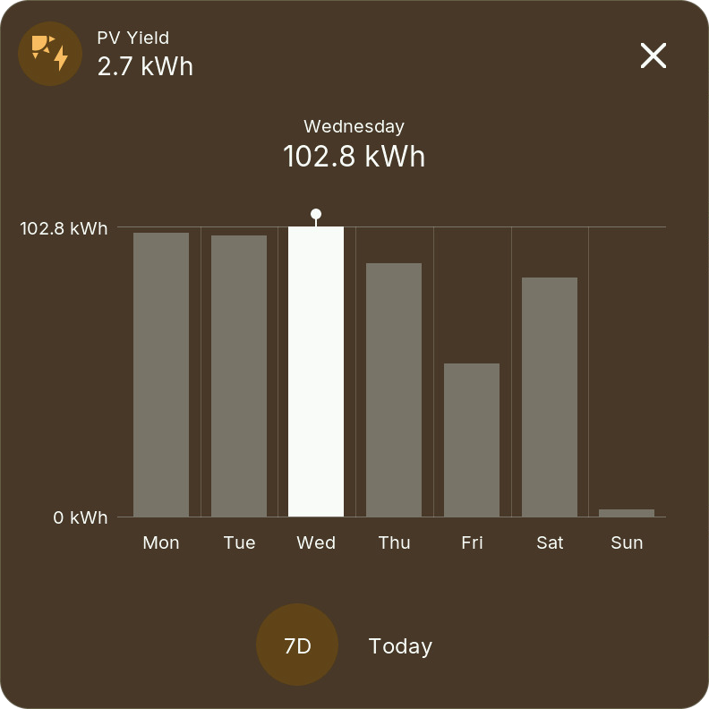
<figcaption>7 days</figcaption>
</figure>

### Weather

View temperatures, precipitation, and rain probability. Use the arrows to browse the available forecast.

<figure class="ht-screenshot ht-popup">
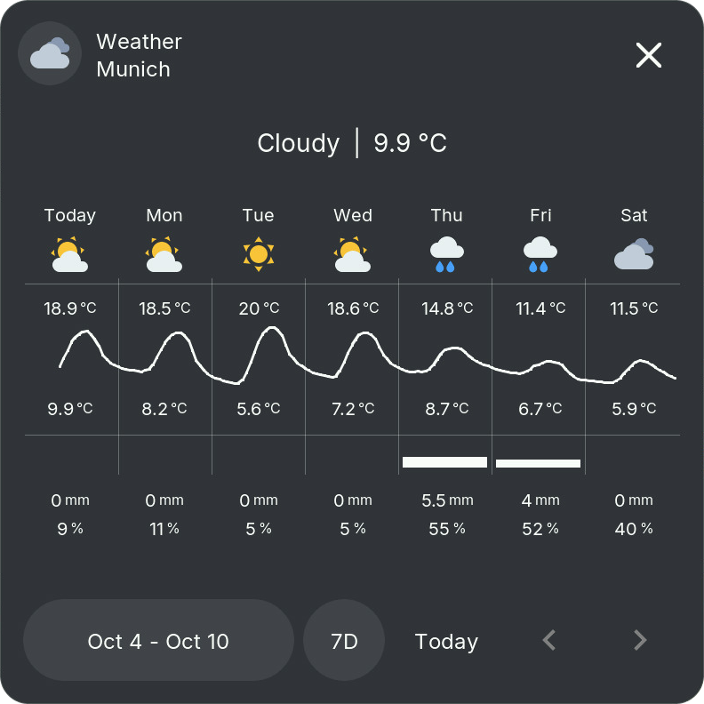
<figcaption>Weather forecast</figcaption>
</figure>

### Media

The popup adds playback controls and a volume slider to the title and cover art.

<figure class="ht-screenshot ht-popup">
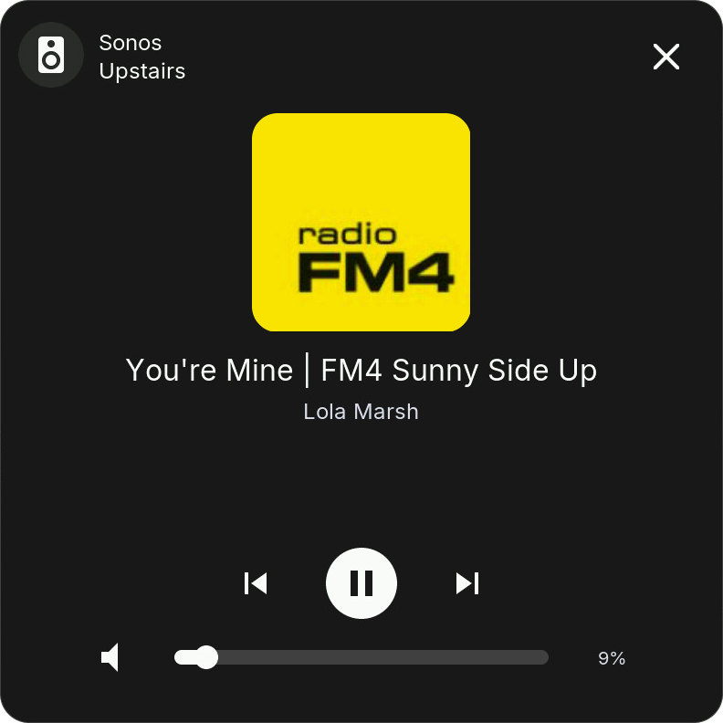
<figcaption>Media playback controls</figcaption>
</figure>

### Climate

Adjust the target temperature with the dial or plus/minus buttons. Available controls may include heating/cooling targets, humidity, mode, presets, fan, and swing. Scroll longer option lists.

These examples show a full air-conditioner control set and a simpler heating-only entity:

<figure class="ht-screenshot ht-popup">
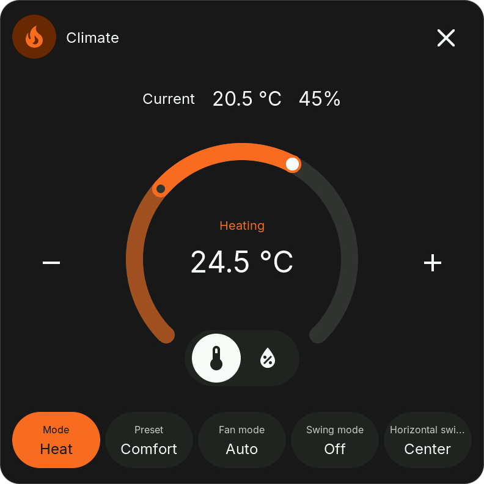
<figcaption>Climate popup with all supported controls</figcaption>
</figure>
<figure class="ht-screenshot">
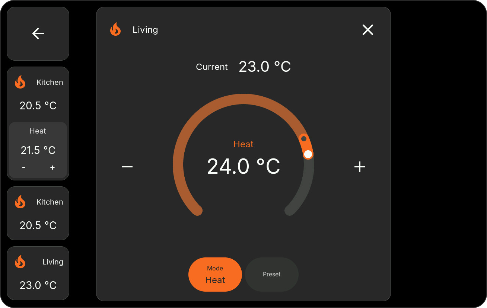
<figcaption>Heat-only Climate popup</figcaption>
</figure>

### Camera

Camera tiles open a 16:9 video popup on ESP32-P4. The source can be a Home Assistant camera or the built-in camera of another HomeTiles display. See [Camera tiles](tiles.md#camera-experimental) for setup and requirements.

<figure class="ht-screenshot ht-popup">
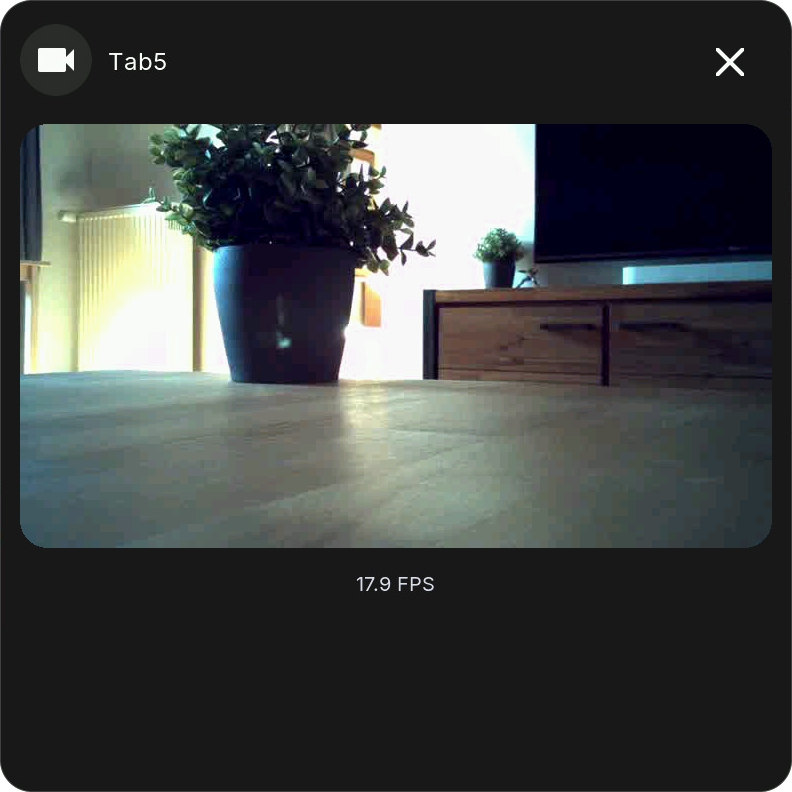
<figcaption>Camera popup with a live image</figcaption>
</figure>

### Built-in Camera Indicator { data-toc-label="Camera indicator" }

While Home Assistant uses the display's own [built-in camera](bridge.md#built-in-camera), a red line runs along the top edge and a **Camera active** pill appears below it. Tap the pill to end the live stream; the camera stays available for the next request. Both parts can be switched off in the [Web Admin](web-admin.md#built-in-camera).

<figure class="ht-screenshot">
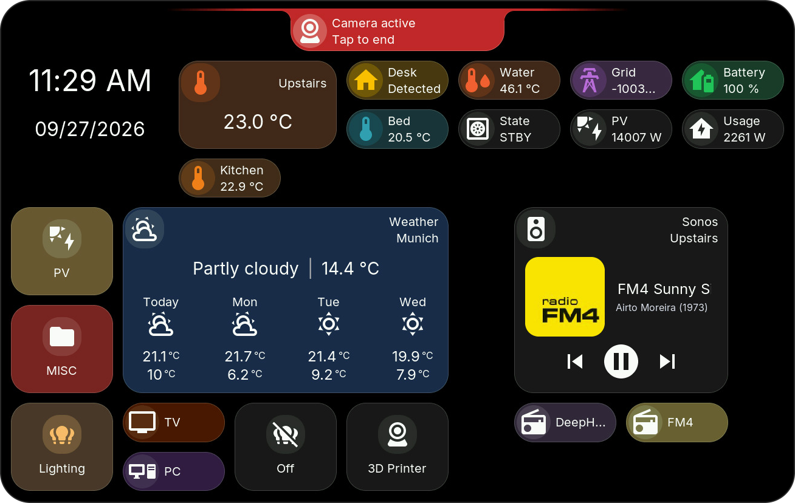
<figcaption>The camera is in use by Home Assistant</figcaption>
</figure>

## Settings

The gear tile opens Settings.

<figure class="ht-screenshot">
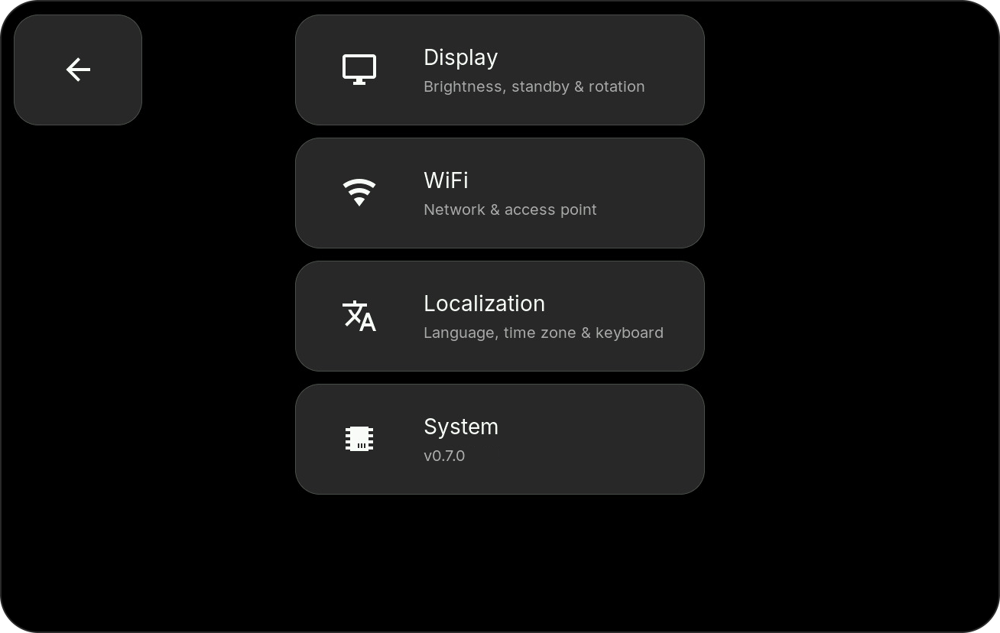
<figcaption>Device settings menu</figcaption>
</figure>

If Settings is PIN-protected, enter the PIN to open it. If its tile is hidden, swipe inward from the configured screen edge; the swipe also works while the tile is visible. The factory PIN **466384537** also unlocks protected folders; see [Settings access](web-admin.md#settings-tile-and-access).

### Display

Adjust brightness, sleep timeout, screensaver timeout, and screensaver brightness. **Never** disables the corresponding timeout. The rotate button turns the UI by 180°.

<figure class="ht-screenshot">
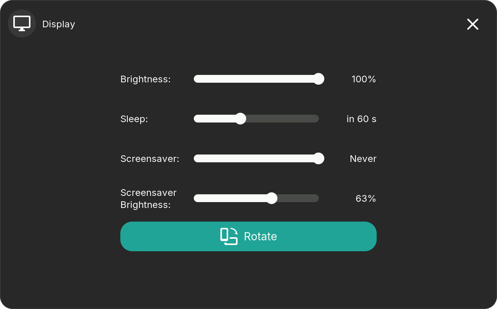
<figcaption>Display and screensaver settings</figcaption>
</figure>

Tap a **Clock** tile to open the screensaver immediately. See [Screensaver](screensaver.md) for its layout and images.

### WiFi

Select a network and enter its password. The connected network is checked, and its IP address opens the [Web Admin](web-admin.md).

<figure class="ht-screenshot">
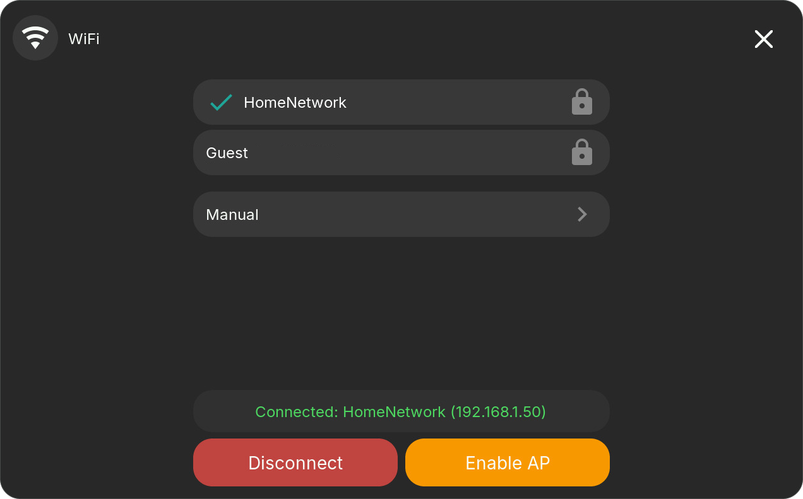
<figcaption>WiFi settings</figcaption>
</figure>

- **Disconnect:** stay offline until you reconnect or restart; saved credentials remain.
- **Enable AP:** connect through the display's hotspot and setup portal.
- **Manual:** enter the SSID and password with the on-screen keyboard.

<figure class="ht-screenshot">
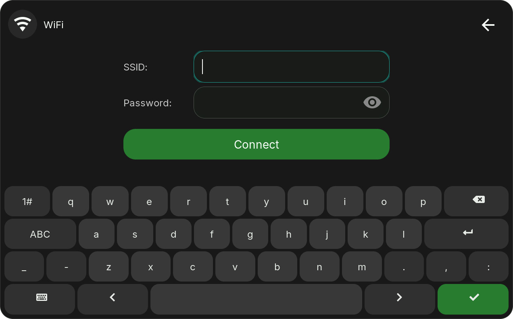
<figcaption>WiFi entry with the on-screen keyboard</figcaption>
</figure>

### Localization

Choose English or German, time zone, date/time formats, and keyboard layout. Tile titles also support Cyrillic characters.

<figure class="ht-screenshot">
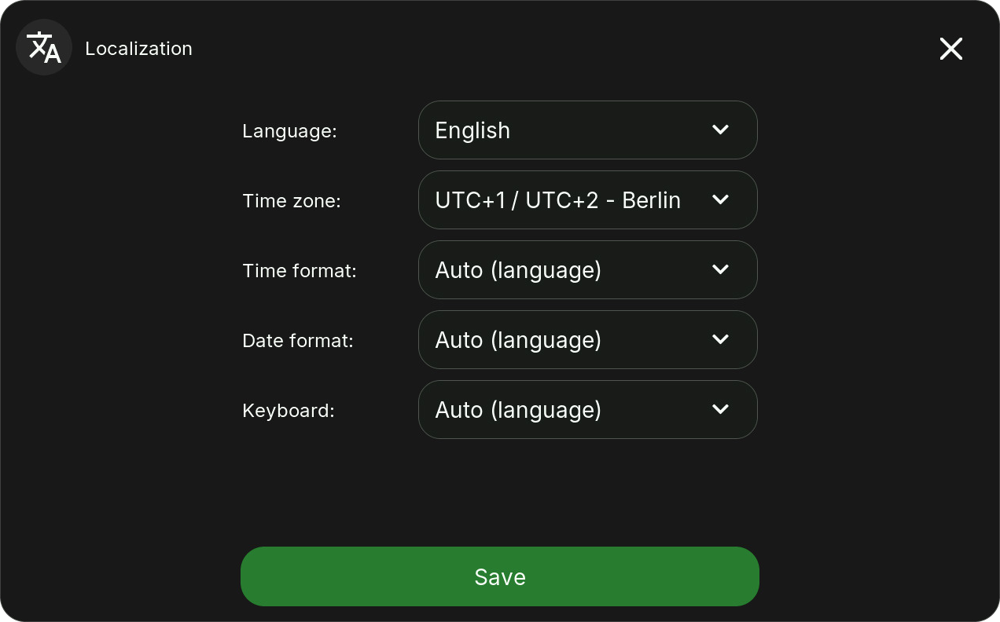
<figcaption>Language and regional settings</figcaption>
</figure>
<figure class="ht-screenshot">
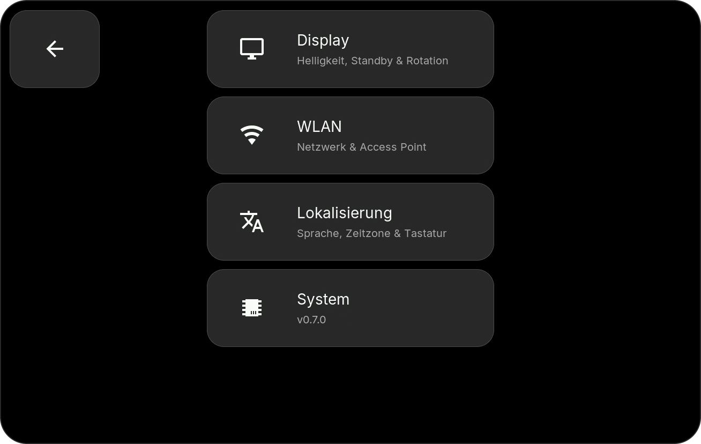
<figcaption>Device settings in German</figcaption>
</figure>

### System

View the firmware version and device name, or use the maintenance actions:

<figure class="ht-screenshot">
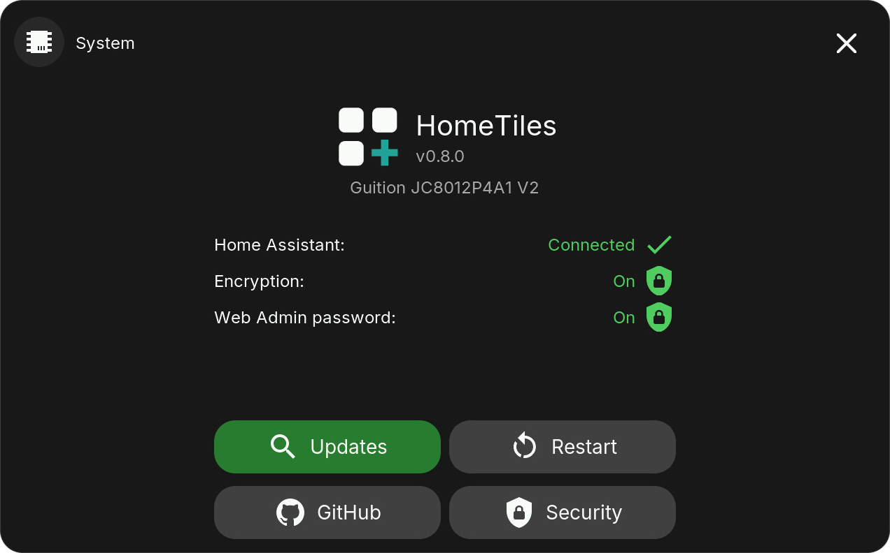
<figcaption>System information and firmware update</figcaption>
</figure>

- **Check for updates:** find and install a new release; see [Firmware Updates](updating.md).
- **Restart:** reboot the display.
- **Pairing:** reconnect MQTT and announce the display to Home Assistant again.
- **GitHub:** show a QR code for the project.
